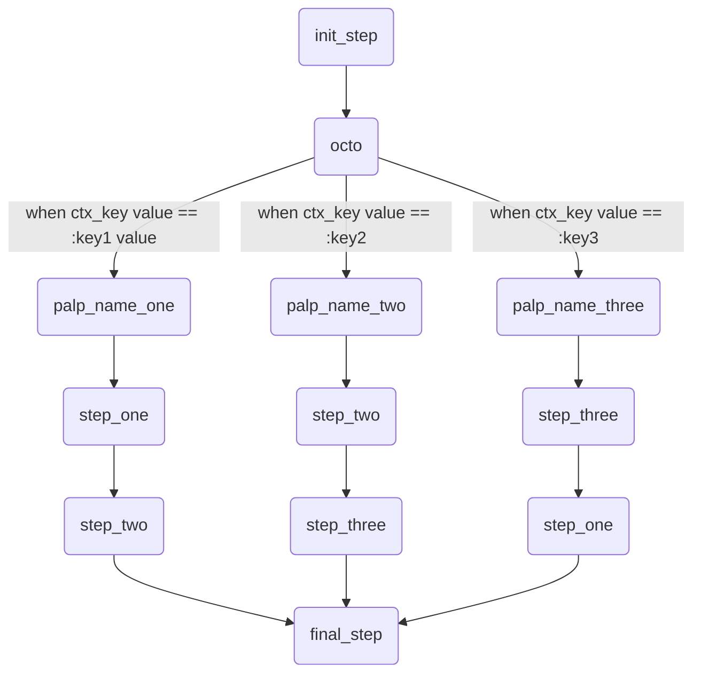

# Octo

It's a step type which helps to implement strategy pattern.

## Signature

```ruby
octo(octo_name, ctx_key:, method:, **options) do
  on :key1, palp: :palp_name_one
  on :key2, palp: :palp_name_two
  on :key3, palp: :palp_name_three
end
```

## Behavior

- Depending on some value you can perform different flow. Imagine that `octo` will be replaced with another flow.
- You have two options to set value for octo. By `ctx_key` and `method` options.
- `ctx_key` and `method` options are controversial, so you can use only one of them.
- with `ctx_key` you can specify the key inside action context with value for `octo`
- with `method` you can specify method name symbol, which will be called to retrieve `octo` value, like we do for `if` and `unless` options.
```ruby
logic do
  palp :palp_name_one do
    step :step_one, on_failure: :step_final
    step :step_two
  end

  palp :palp_name_two do
    step :step_two
    step :step_three
  end

  palp :palp_name_three do
    step :step_three
    step :step_one
  end

  step :init_step

  octo :octo_name, ctx_key: :some_key do
    on :key1, palp: :palp_name_one
    on :key2, palp: :palp_name_two
    on :key3, palp: :palp_name_three
  end

  step :step_final
end
```



### Palp
Currently only one possibility is present to define flow for `octo`, it's `palp`

<details><summary><b>EXAMPLE (CLICK ME)</b></summary>
<p>

  ```ruby
    require 'decouplio'

    class SomeAction < Decouplio::Action
      logic do
        # it doesn't matter where you define palp
        # at the beginning of logic block
        # or at the end or in the middle
        palp :option_one_palp do
          step :step_one, on_failure: :final_step
          step :step_two
        end

        palp :option_two_palp do
          step :step_two
          step :step_three
        end

        palp :option_three_palp do
          step :step_three
          step :step_one
          fail :fail_one
        end

        step :init_step

        octo :my_octo, ctx_key: :custom_key do
          on :option_one, palp: :option_one_palp
          on :option_two, palp: :option_two_palp
          on :option_three, palp: :option_three_palp
        end

        step :final_step
        fail :fail_two
      end

      def init_step(octo_key:, **)
        ctx[:custom_key] = octo_key
      end

      def step_one(param_for_step_one:, **)
        ctx[:step_one] = param_for_step_one
      end

      def step_two(param_for_step_two:, **)
        ctx[:step_two] = param_for_step_two
      end

      def step_three(param_for_step_three:, **)
        ctx[:step_three] = param_for_step_three
      end

      def fail_one(**)
        ctx[:fail_one] = 'Failure'
      end

      def final_step(**)
        ctx[:final_step] = 'Success'
      end

      def fail_two(**)
        ctx[:fail_two] = 'Failure'
      end
    end


    octo_option_one_success = SomeAction.call(
      octo_key: :option_one,
      param_for_step_one: true,
      param_for_step_two: true
    )
    octo_option_one_failure = SomeAction.call(
      octo_key: :option_one,
      param_for_step_one: false,
      param_for_step_two: true
    )
    octo_option_two_success = SomeAction.call(
      octo_key: :option_two,
      param_for_step_two: true,
      param_for_step_three: true
    )
    octo_option_two_failure = SomeAction.call(
      octo_key: :option_two,
      param_for_step_two: true,
      param_for_step_three: false
    )
    octo_option_three_success = SomeAction.call(
      octo_key: :option_three,
      param_for_step_one: true,
      param_for_step_three: true
    )
    octo_option_three_failure = SomeAction.call(
      octo_key: :option_three,
      param_for_step_one: false,
      param_for_step_three: true
    )
    octo_option_one_success # =>
    # Result: success

    # Railway Flow:
    #   init_step -> my_octo -> step_one -> step_two -> final_step

    # Context:
    #   {:octo_key=>:option_one, :param_for_step_one=>true, :param_for_step_two=>true, :custom_key=>:option_one, :step_one=>true, :step_two=>true, :final_step=>"Success"}

    # Errors:
    #   {}
    octo_option_one_failure # =>
    # Result: success

    # Railway Flow:
    #   init_step -> my_octo -> step_one -> final_step

    # Context:
    #   {:octo_key=>:option_one, :param_for_step_one=>false, :param_for_step_two=>true, :custom_key=>:option_one, :step_one=>false, :final_step=>"Success"}

    # Errors:
    #   {}
    octo_option_two_success # =>
    # Result: success

    # Railway Flow:
    #   init_step -> my_octo -> step_two -> step_three -> final_step

    # Context:
    #   {:octo_key=>:option_two, :param_for_step_two=>true, :param_for_step_three=>true, :custom_key=>:option_two, :step_two=>true, :step_three=>true, :final_step=>"Success"}

    # Errors:
    #   {}
    octo_option_two_failure # =>
    # Result: failure

    # Railway Flow:
    #   init_step -> my_octo -> step_two -> step_three -> fail_two

    # Context:
    #   {:octo_key=>:option_two, :param_for_step_two=>true, :param_for_step_three=>false, :custom_key=>:option_two, :step_two=>true, :step_three=>false, :fail_two=>"Failure"}

    # Errors:
    #   {}
    octo_option_three_success # =>
    # Result: success

    # Railway Flow:
    #   init_step -> my_octo -> step_three -> step_one -> final_step

    # Context:
    #   {:octo_key=>:option_three, :param_for_step_one=>true, :param_for_step_three=>true, :custom_key=>:option_three, :step_three=>true, :step_one=>true, :final_step=>"Success"}

    # Errors:
    #   {}
    octo_option_three_failure # =>
    # Result: failure

    # Railway Flow:
    #   init_step -> my_octo -> step_three -> step_one -> fail_one -> fail_two

    # Context:
    #   {:octo_key=>:option_three, :param_for_step_one=>false, :param_for_step_three=>true, :custom_key=>:option_three, :step_three=>true, :step_one=>false, :fail_one=>"Failure", :fail_two=>"Failure"}

    # Errors:
    #   {}
  ```

  ```mermaid
    flowchart TD
        1(start)-->2(init_step);
        2(init_step)-->|success track|3(octo);
        2(init_step)-->|failure track|11(fail_two);
        3(octo)-->|custom_key value == :option_one|4(option_one_palp);
        4(option_one_palp)-->|success track|5(step_one);
        5(step_one)-->|success track|6(step_two);
        6(step_two)-->|success track|7(final_step);
        5(step_one)-->|failure track|7(final_step);
        6(step_two)-->|failure track|11(fail_two);
        3(octo)-->|custom_key value == :option_two|8(option_two_palp);
        8(option_two_palp)-->|success track|9(step_two);
        9(step_two)-->|success track|10(step_three);
        9(step_two)-->|failure track|11(fail_two);
        10(step_three)-->|success track|7(final_step);
        10(step_three)-->|failure track|11(fail_two);
        3(octo)-->|custom_key value == :option_three|12(option_three_palp);
        12(option_three_palp)-->|success track|13(step_three);
        13(step_three)-->|success track|14(step_one);
        14(step_one)-->|success track|7(final_step);
        13(step_three)-->|failure track|15(fail_one);
        14(step_one)-->|failure track|15(fail_one);
        15(fail_one)-->|failure track|11(fail_two);
  ```

</p>
</details>

***
## Options

### ctx_key: context key with octo value

See examples above

***

### method: method symbol which returns octo value
<details><summary><b>EXAMPLE (CLICK ME)</b></summary>
<p>

  ```ruby
    require 'decouplio'

    class SomeAction < Decouplio::Action
      logic do
        palp :palp_one do
          step :step_one
        end

        palp :palp_two do
          step :step_two
        end

        octo :octo_name, method: :what_is_next? do
          on :option_one, palp: :palp_one
          on :option_two, palp: :palp_two
        end
      end

      def step_one(**)
        # ...
      end

      def step_two(**)
        # ...
      end

      def what_is_next?(connection:, url:)
        connection.get(url).body[:decision]
      end
    end
  ```

</p>
</details>

***

### if: condition method name
The same as for [step](https://github.com/differencialx/decouplio/blob/master/docs/step.md)

***

### unless: condition method name
The same as for [step](https://github.com/differencialx/decouplio/blob/master/docs/step.md)

***
